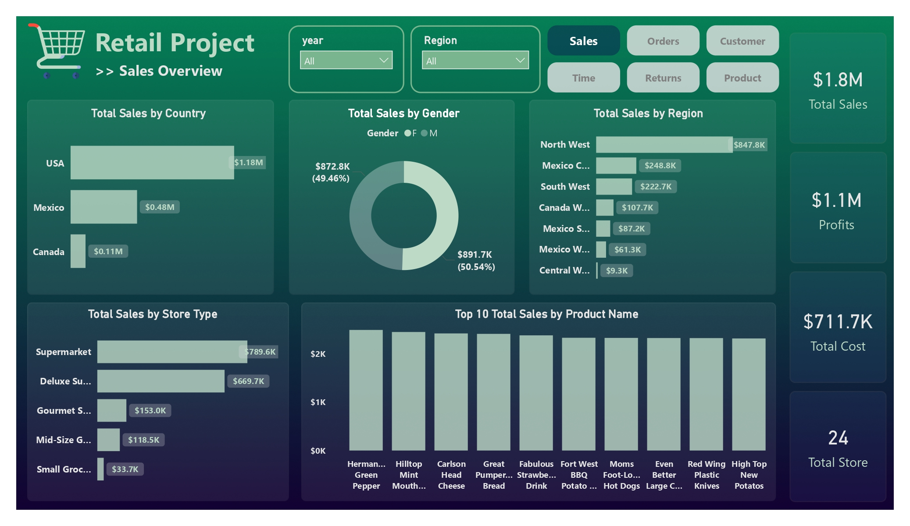
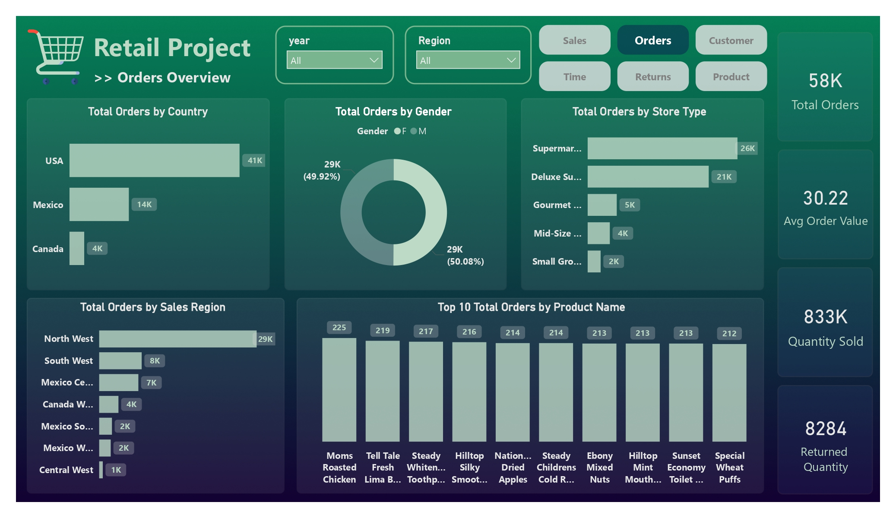
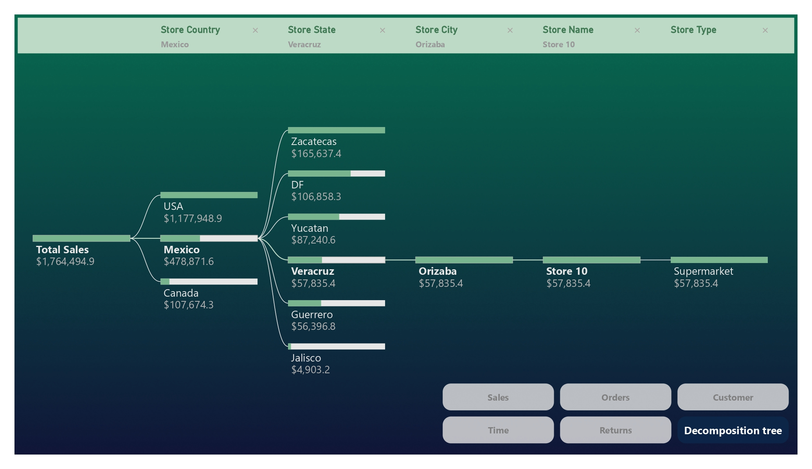

# 🛒 Retail Analysis Dashboard | Power BI

A complete **Retail Analysis Dashboard** built using **Power BI**, designed to analyze sales, orders, customers, returns, and product performance across different countries, regions, and store types.

This project focuses on transforming raw retail data into meaningful business insights through interactive dashboards and data storytelling.

---

## 📌 Project Overview

The dashboard provides a detailed analysis of retail business performance using multiple report pages and interactive visualizations.

It helps answer important business questions such as:

- Which country generates the highest sales?
- Which regions and store types perform best?
- What are the top-selling products?
- How do orders and returns impact the business?
- What insights can be discovered using decomposition analysis?

---

## 🛠 Tools & Technologies

- **Power BI**
- **Power Query**
- **DAX**
- **SQL**
- **Data Modeling**
- **Data Cleaning & Transformation**

---

## 📊 Dashboard Pages

### 1️⃣ Sales Overview
- Total Sales
- Total Profit
- Total Cost
- Total Stores
- Sales by Country
- Sales by Region
- Sales by Store Type
- Top 10 Products by Sales

---

### 2️⃣ Orders Overview
- Total Orders
- Average Order Value
- Quantity Sold
- Returned Quantity
- Orders by Country
- Orders by Region
- Orders by Store Type
- Top 10 Products by Orders

---

### 3️⃣ Decomposition Tree Analysis
Interactive decomposition tree used to drill down sales performance by:
- Country
- State
- City
- Store Name
- Store Type

---

# 📸 Dashboard Preview

## 🔹 Sales Overview


---

## 🔹 Orders Overview


---

## 🔹 Decomposition Tree


---

## 📈 Key Insights

- USA generated the highest sales and orders.
- Supermarkets contributed the largest share of sales.
- North West region achieved the highest revenue.
- Product performance analysis highlights top-selling items.
- Decomposition Tree enables deep drill-down analysis for decision making.

---

## 🧩 Features

✔ Interactive slicers and filters  
✔ Dynamic KPI cards  
✔ Clean and modern UI design  
✔ Multi-page dashboard navigation  
✔ Drill-down analysis using decomposition tree  
✔ Responsive and user-friendly layout  

---

## 📂 Repository Structure

```bash
Retail-Analysis-Dashboard-power-bi/
│
├── Retail Dashboard.pbix
├── sales.jpg
├── orders.jpg
├── decomposition_tree.jpg
└── README.md
```

---

## 🚀 How to Use

1. Download the `.pbix` file
2. Open using **Power BI Desktop**
3. Explore the interactive dashboard pages
4. Use slicers and filters for deeper analysis

---

## 🎯 Project Goals

This project was created to practice and demonstrate:
- Data Analysis
- Business Intelligence
- Dashboard Design
- Data Visualization
- DAX Calculations
- Storytelling with Data

---

## 👩‍💻 Author

**Marwa Mohamed**

- GitHub: [marwamohamed51](https://github.com/marwamohamed51)

---

## ⭐ If you like this project

Give the repository a ⭐ on GitHub!

---

## 🔗 Repository Link

[Retail Analysis Dashboard Repository](https://github.com/marwamohamed51/Retail-Analysis-Dashboard-power-bi)
